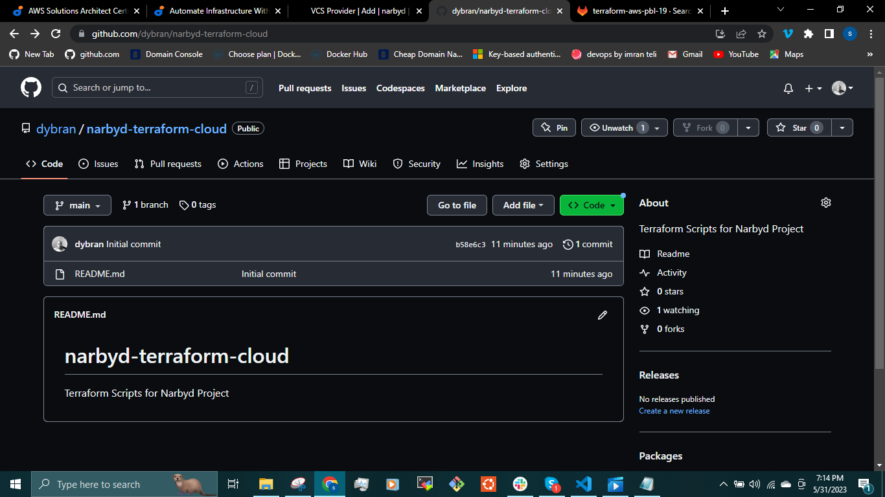
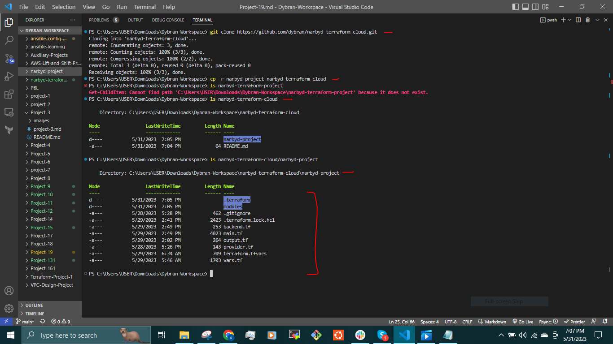
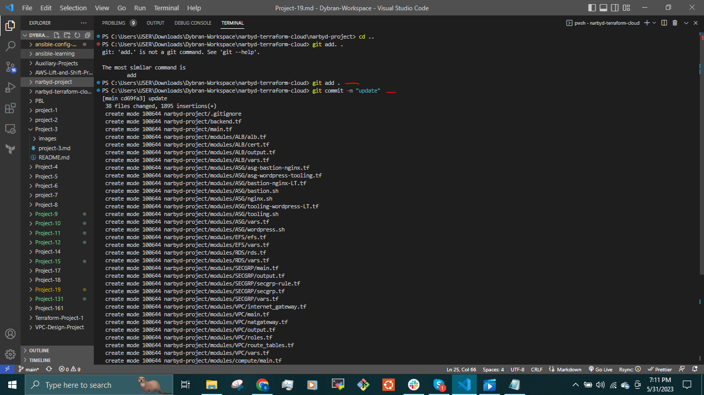
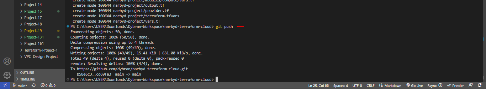
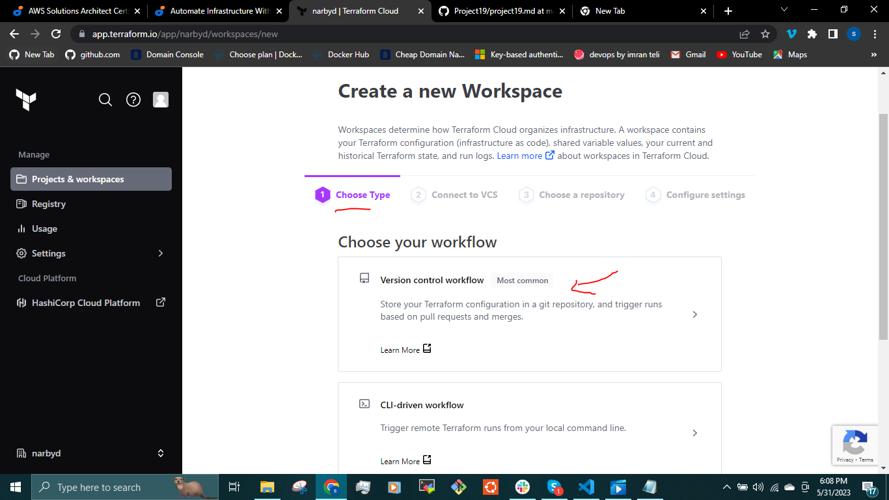
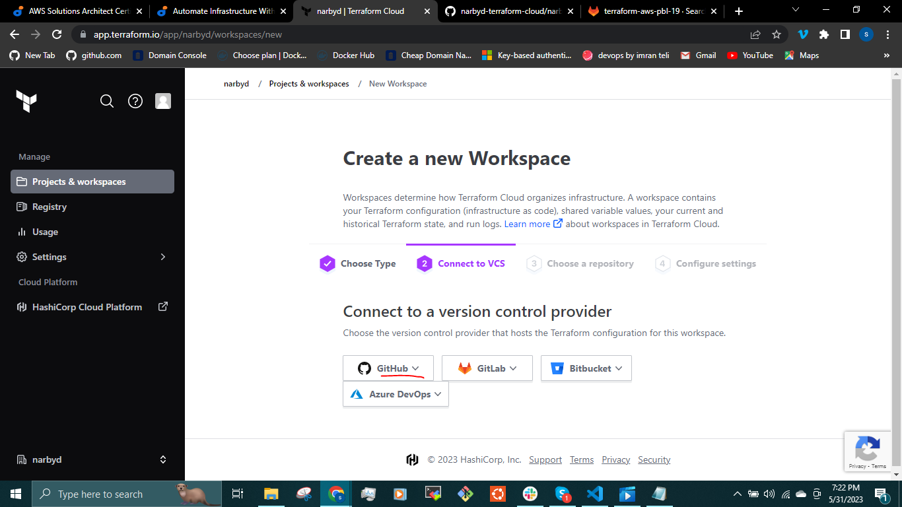
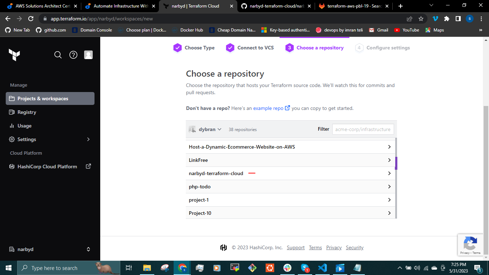
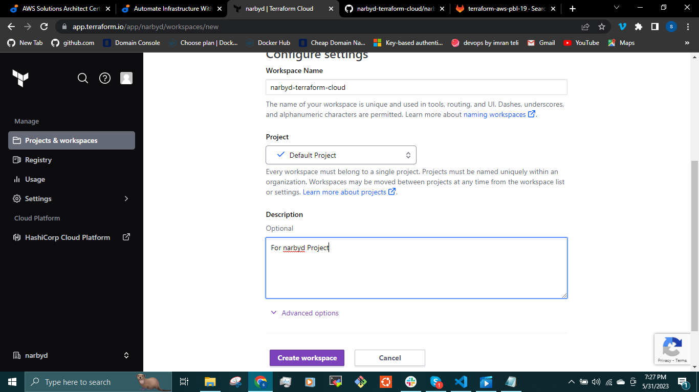
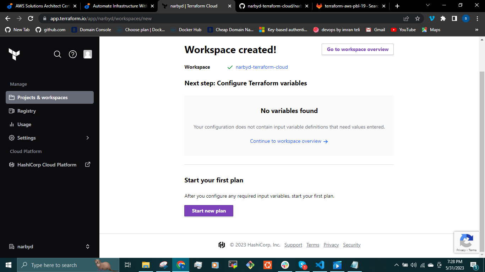

### __USING TERRAFORM IAC TOOL TO AUTOMATE AWS CLOUD SOLUTION FOR 2 COMPANY WEBSITES (INTRODUCING TERRAFORM CLOUD, ANSIBLE & PACKER) - CONTINUATION__.

In [Project-18](https://github.com/dybran/Project-18/blob/main/Project-18.md), we migrated our __terraform.tfstate__ file to __S3__ bucket for easy collaboration amongst DevOps team mates in an organisation.

We will be introducing [__Terraform Cloud__](https://developer.hashicorp.com/terraform/cloud-docs). Terraform Cloud is an application that helps teams use Terraform together. It manages Terraform runs in a consistent and reliable environment, and includes easy access to shared state and secret data, access controls for approving changes to infrastructure, a private registry for sharing Terraform modules, detailed policy controls for governing the contents of Terraform configurations and more.
Teams can  connect Terraform to version control, share variables, run Terraform in a stable remote environment, and securely store remote state.

Terraform Cloud executes Terraform commands on disposable virtual machines, this remote execution is also called [remote operations.](https://developer.hashicorp.com/terraform/cloud-docs/run/remote-operations).

__TASK__

Instead of running the Terraform codes in __Project-18__ from a command line, rather it is being executed from __TERRAFORM CLOUD__ console. The AMI is built with __PACKER__ while __ANSIBLE__ is used to configure the infrastructure after its been provisioned by Terraform.

__PREREQUISITE__

- Install __ANSIBLE__
- Install [__PACKER__](https://developer.hashicorp.com/packer/downloads?product_intent=packer).
- Configure [__AWS CLI__](https://www.youtube.com/watch?v=u0JyzUGzvJA)

### __Migrate the .tf codes to Terraform Cloud__.

We can migrate our codes to __Terraform Cloud__ and manage our __AWS__ infrastructure from the terraform cloud.

Create a new repository in our GitHub __narbyd-terraform-cloud__.

Clone the repository and copy the codes into the repository. Then push the Terraform codes in the __narbyd-project__  to the repository.

Create a Terraform Cloud account

